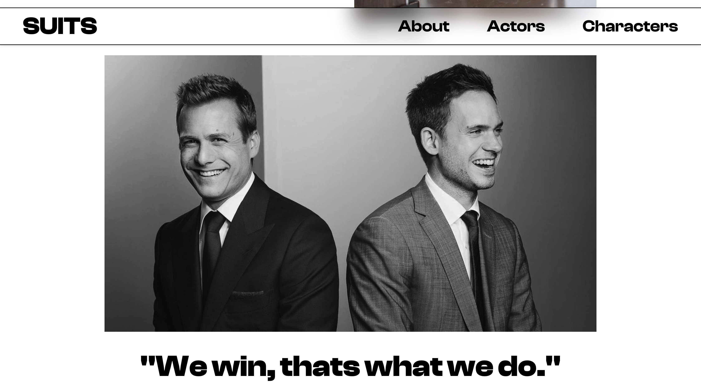
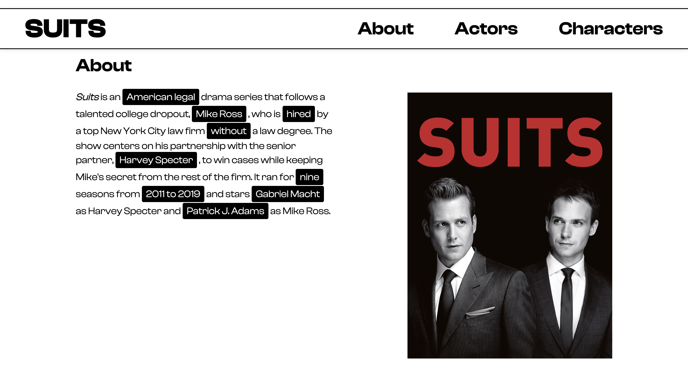

# 🕴️ Suits Webpage

A clean, responsive front-end webpage inspired by the TV series **Suits**.
Built with **HTML** and **CSS**, the project features a cinematic hero, cast highlights, and a modern, minimal aesthetic.

---

## 🚀 Features

- **Responsive design** (desktop → tablet → mobile).
- **Pure front-end**: HTML & CSS only.
- Cinematic **hero section** with overlay text and gradient tint.
- Scrolling actor reels, character sections, and quote blocks
- Reusable design tokens via CSS variables for consistent typography and spacing

---

## 🖼️ Screenshots

### 📱 Mobile View

### 🏠 Home Page

### 📄 Main Page

---

## 🧩 Tech Stack

| Technology | Purpose |
|-------------|----------|
| **HTML5** | Structure & Content |
| **CSS3** | Styling, Layout, and Responsiveness |
| **Flexbox & Grid** | Used for responsive layouts |

---

